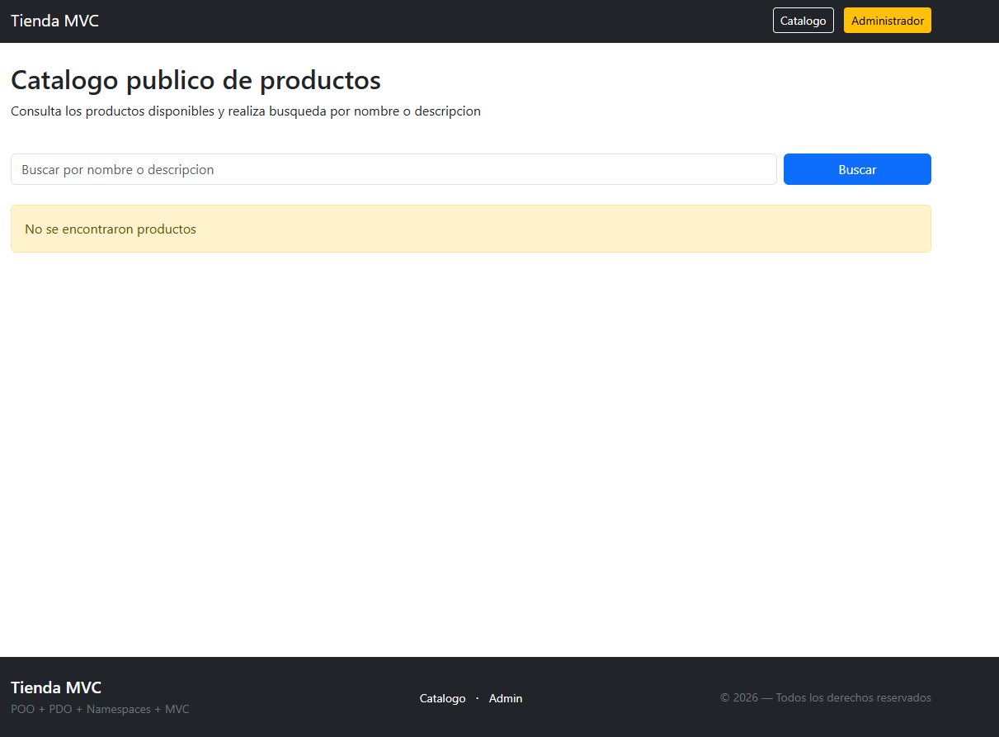
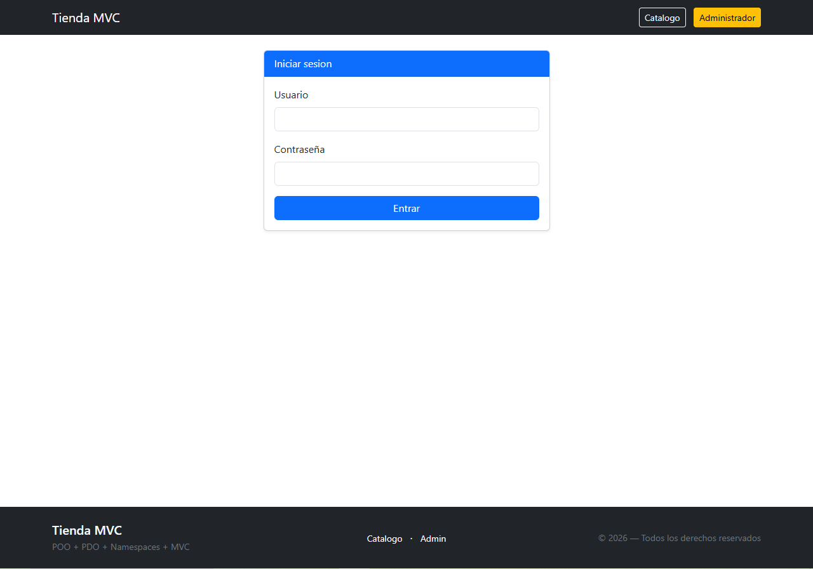
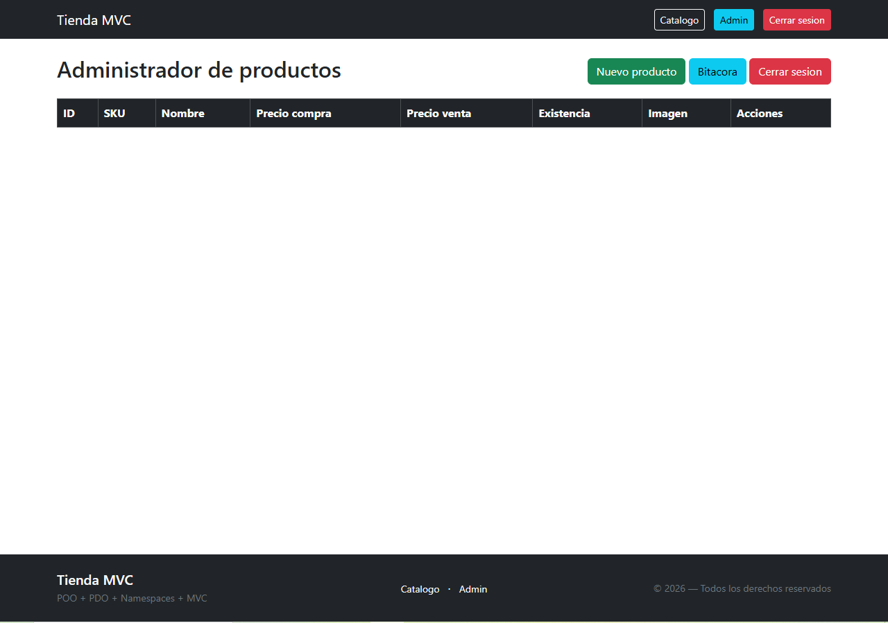
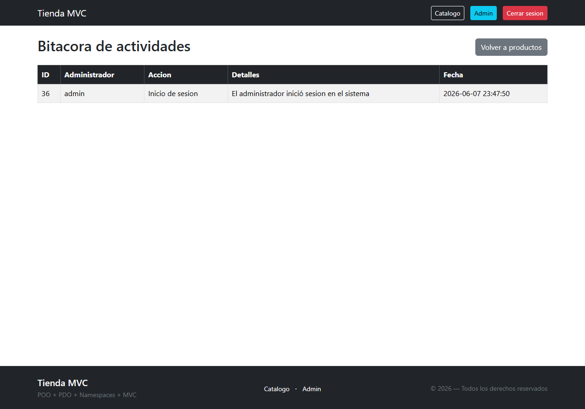

# Práctica Final - Proyecto Integrador

## Objetivo
Implementar un sistema de tienda en línea bajo el patrón MVC en PHP, con un
panel de administración protegido que permita gestionar productos (CRUD) y
consultar una bitácora de acciones, complementado con una API REST pública
para la consulta de productos. El visitante puede navegar un catálogo sin
necesidad de autenticarse.

## Tecnologías utilizadas
- **Lenguaje:** PHP 8+
- **Servidor web:** Apache con `mod_rewrite` (URL amigables mediante `.htaccess`)
- **Base de datos:** MySQL / MariaDB
- **Acceso a datos:** PDO con sentencias preparadas
- **Arquitectura:** MVC con Front Controller (`index.php`) y autoloader propio
- **Autenticación:** sesiones PHP + `password_hash` / `password_verify` (bcrypt)
- **Seguridad:** protección CSRF en formularios (`Helpers\Csrf`)
- **API:** endpoints REST que responden JSON (`/api/productos` y `/api/productos/{id}`)
- **Frontend:** PHP + HTML + Bootstrap (vistas en `views/`)

## Instrucciones de ejecución
1. Clonar o copiar el proyecto dentro del directorio público de Apache
   (por ejemplo `htdocs/proyecto-final`).
2. Importar el esquema en MySQL:
   ```bash
   mysql -u root -p < database.sql
   ```
   Esto crea la base de datos `tienda_mvc` con las tablas `usuarios`,
   `productos` y `bitacora`, e inserta el usuario `admin`.
3. Ajustar las credenciales de conexión en `config/Database.php`
   (`host`, `dbName`, `username`, `password`) si difieren de
   `root` / contraseña vacía.
4. Verificar que Apache tenga `mod_rewrite` habilitado y `AllowOverride All`
   activo para que el archivo `.htaccess` funcione correctamente.
5. Levantar Apache y MySQL, y abrir en el navegador:
   ```
   http://localhost/proyecto-final/
   ```
6. Regenerar la contraseña del usuario `admin` ejecutando una sola vez:
   ```php
   echo password_hash('TU_NUEVA_PASSWORD', PASSWORD_BCRYPT);
   ```
   y actualizar el campo `password` de la fila con `username = 'admin'` en
   la tabla `usuarios` con el hash obtenido.
7. Rutas principales del sistema:
   - `/` o `/catalogo` — catálogo público.
   - `/login` — acceso al panel de administración.
   - `/productos` — CRUD de productos (requiere sesión iniciada).
   - `/productos/bitacora` — bitácora de acciones del administrador.
   - `/api/productos` — listado de productos en JSON.
   - `/api/productos/{id}` — detalle de un producto en JSON.

## Evidencias de funcionamiento

A continuación se muestran las pantallas principales del sistema en ejecución:

### Catálogo público
Permite a cualquier visitante consultar y buscar productos sin autenticarse.


### Inicio de sesión
Acceso al panel de administración con token CSRF.


### Panel de administración
CRUD completo de productos (crear, listar, editar y eliminar).


### Bitácora de actividades
Registro de las acciones realizadas por los administradores.
